# POC Apache CloudStack com KVM e NFS

Prova de conceito acadêmica de uma nuvem privada baseada no **Apache CloudStack 4.22.1.1**, com KVM, armazenamento NFS e rede Advanced. O relatório completo está em [relatorio/RELATORIO-POC-CLOUDSTACK.md](relatorio/RELATORIO-POC-CLOUDSTACK.md).

> Status atual: infraestrutura, Management Server, host KVM, zona e storages configurados. As System VMs ainda estavam em inicialização na última evidência.

## Arquitetura do laboratório

| Componente | Configuração |
| --- | --- |
| Hipervisor externo | Oracle VirtualBox |
| Management Server | `cs-mgmt.lab.local` — `192.168.100.10/24` |
| Host KVM | `cs-kvm01.lab.local` — `192.168.100.11/24` |
| Rede de gerenciamento | VirtualBox Internal Network `cs-mgmt-net` |
| Rede pública/convidados | VirtualBox Internal Network `cs-public-net` |
| Armazenamento primário | NFS `192.168.100.10:/export/primary` |
| Armazenamento secundário | NFS `192.168.100.10:/export/secondary` |

## Evidências da execução

### 1. Host KVM e rede

KVM e aceleração por hardware foram validados no host de computação.

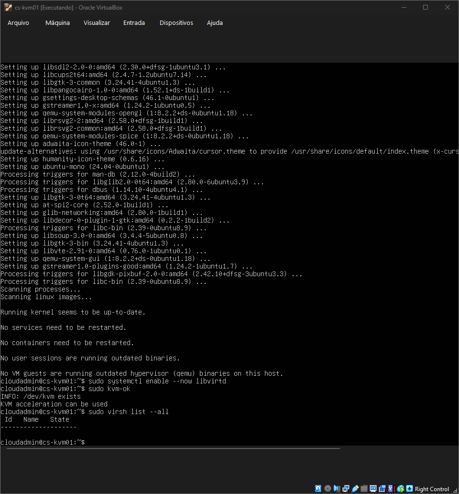

As bridges usadas pelo CloudStack foram configuradas da seguinte forma: `cloudbr0` para gerenciamento/storage e `cloudbr1` para tráfego público e de convidados.

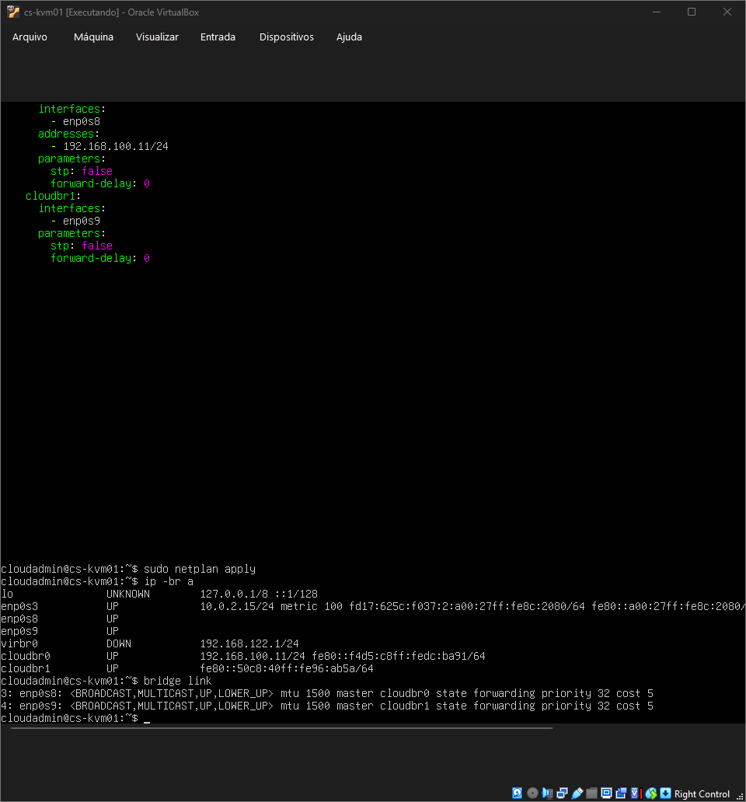

### 2. NFS primário e secundário

O Management Server exporta o diretório `/export` ao host KVM com permissão de escrita para a POC.

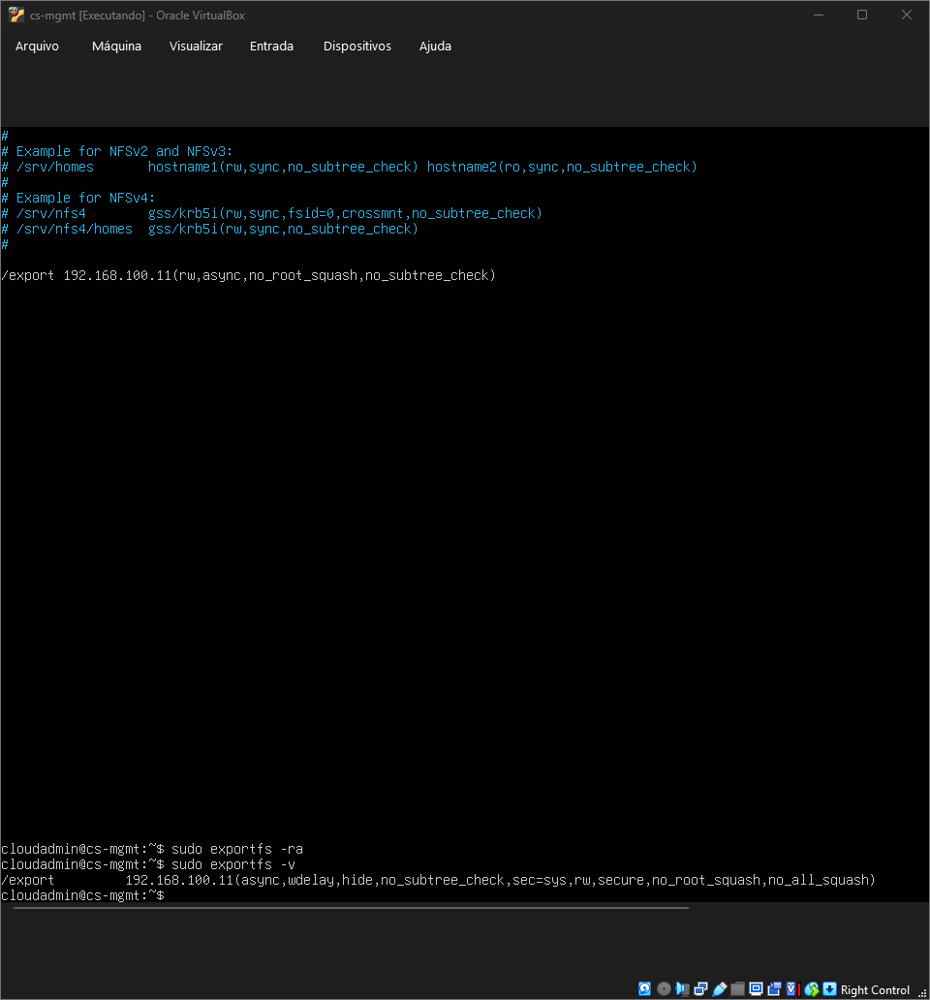

A montagem foi validada no KVM com criação de arquivo no compartilhamento remoto.

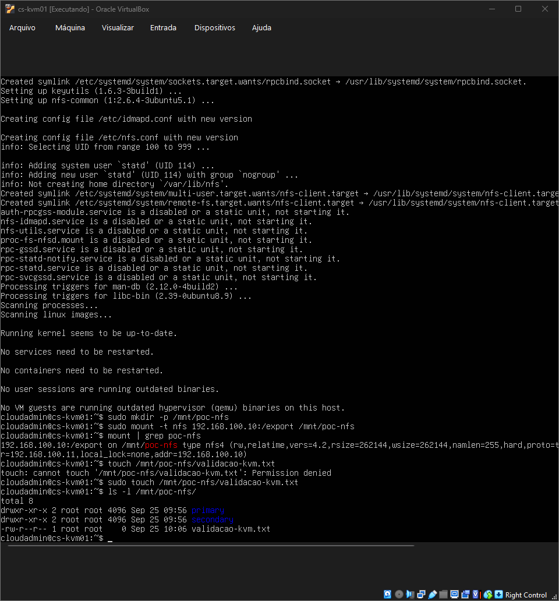

### 3. Instalação do CloudStack

O repositório oficial do CloudStack 4.22 foi configurado para Ubuntu Noble, com a versão 4.22.1.1 disponível.

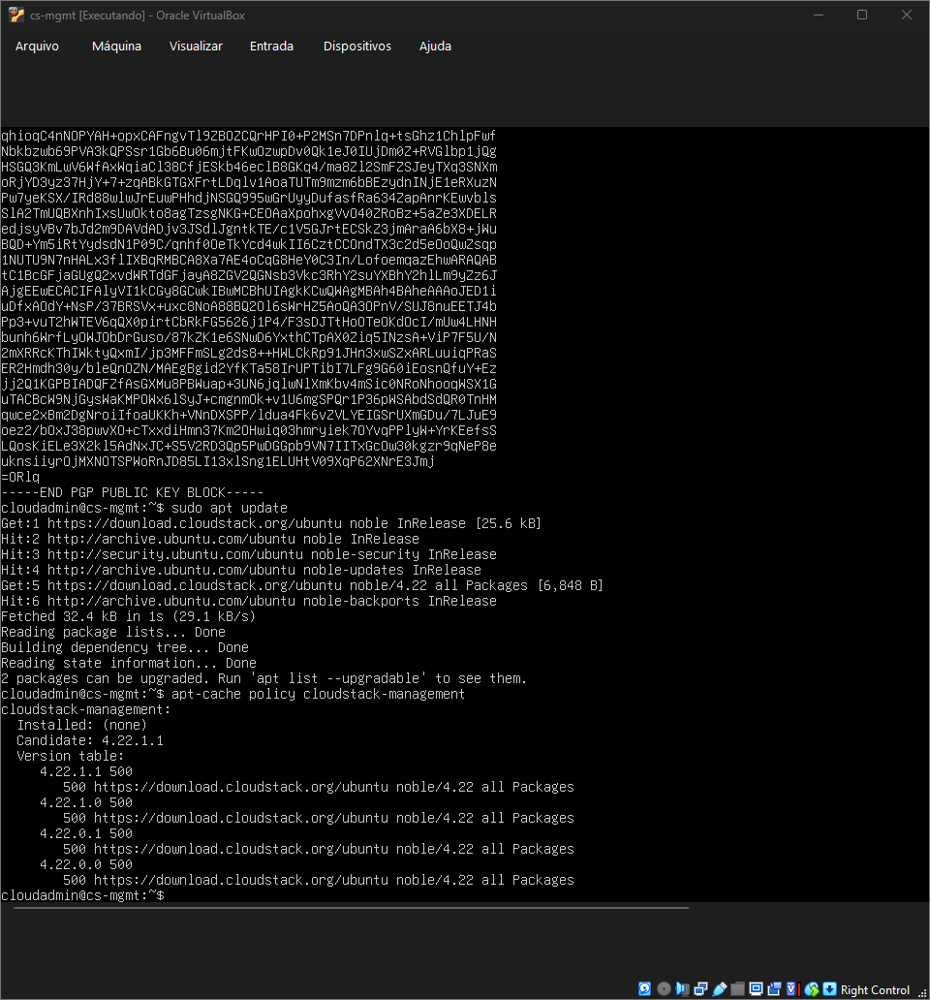

O Management Server, MySQL e Java 17 foram instalados e validados.

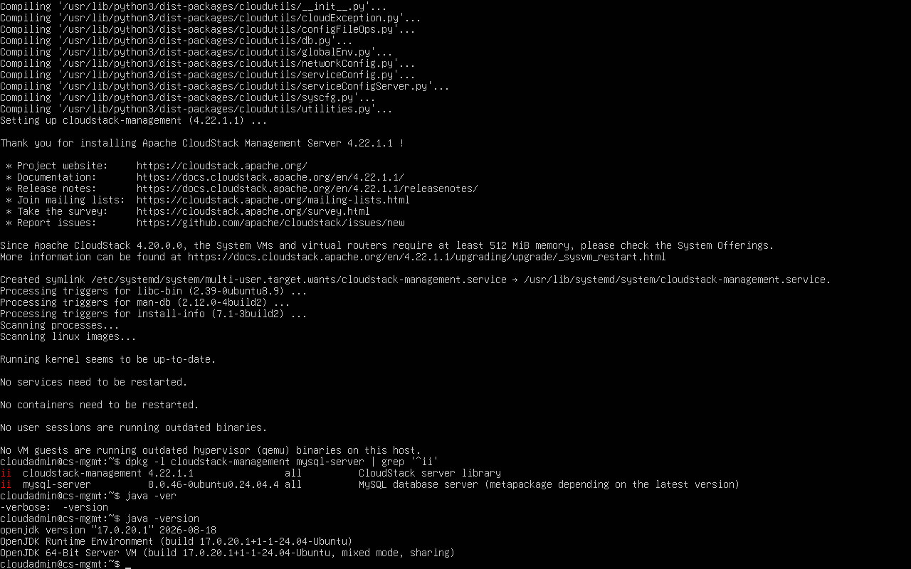

Os parâmetros obrigatórios do MySQL foram aplicados: `binlog_format=ROW`, `max_connections=350` e `server_id=1`.

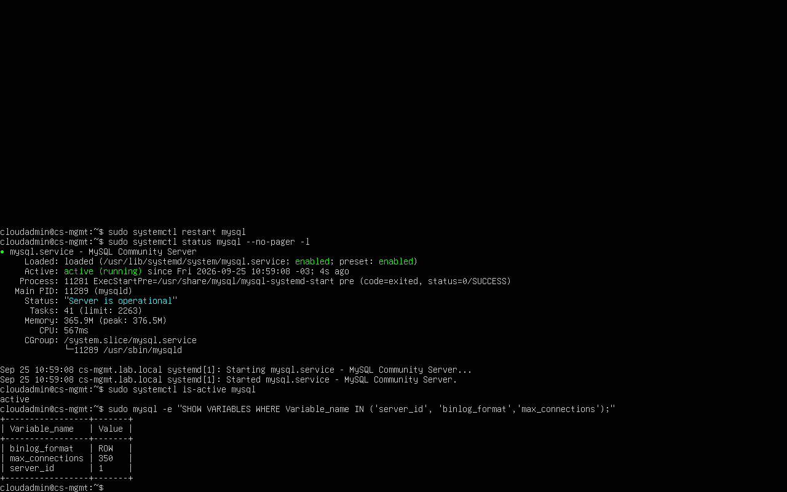

Os bancos do CloudStack foram inicializados com sucesso.

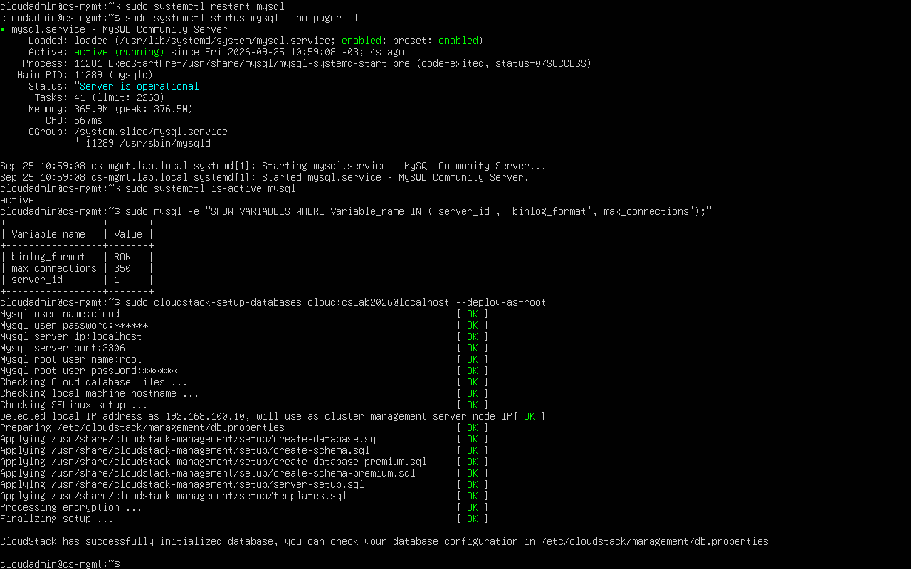

### 4. Console web e template de sistema

O serviço de gerenciamento respondeu localmente na porta 8080.

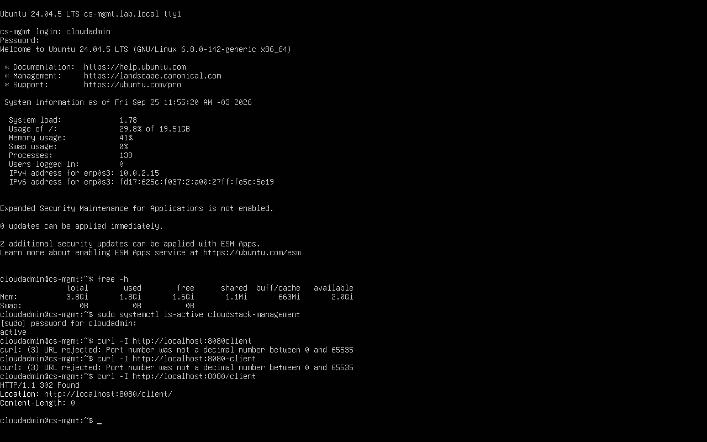

O console foi publicado no computador hospedeiro pelo redirecionamento NAT do VirtualBox.

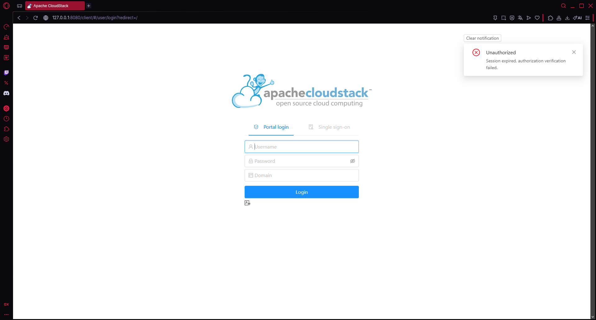

O login administrativo abriu o painel inicial do CloudStack.

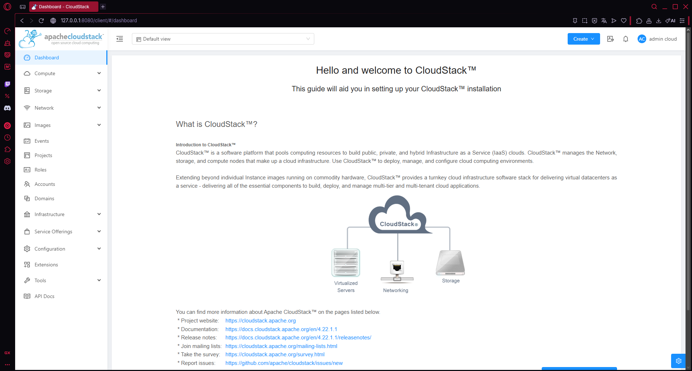

O template de sistema para KVM foi instalado no armazenamento secundário.

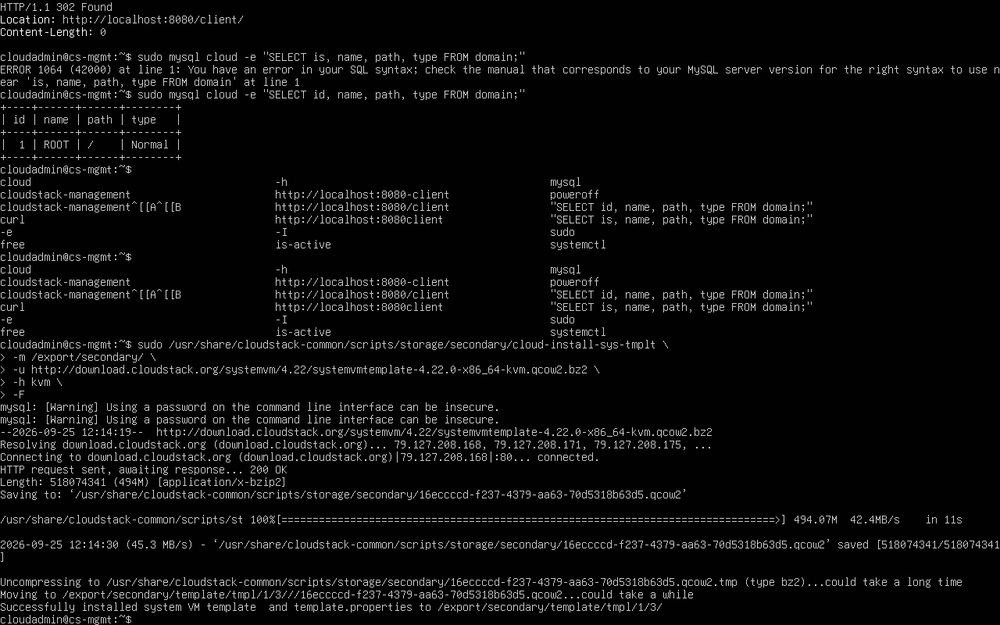

### 5. Agente KVM, zona e storages

O agente CloudStack do KVM foi configurado para se comunicar com o Management Server em `192.168.100.10:8250`.

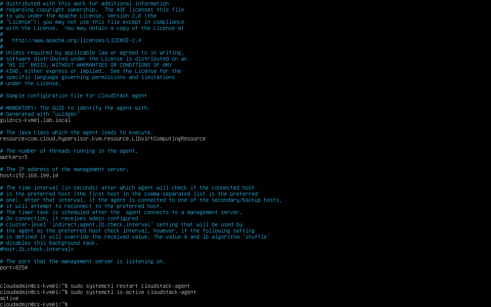

A zona `POC-Zone` foi habilitada. A Secondary Storage VM iniciou o provisionamento no host KVM; esta é uma evidência de progresso, não de conclusão das System VMs.

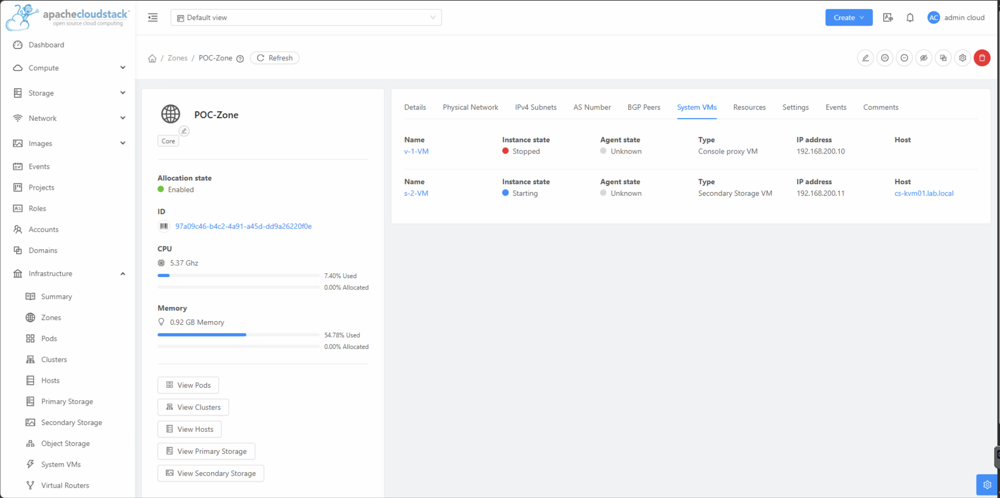

## Próximas etapas

1. Confirmar a execução das System VMs.
2. Provisionar uma instância de teste.
3. Validar rede isolada, IP público e NAT.
4. Criar e testar volume e snapshot.
5. Demonstrar multitenancy e a integração Kubernetes/CSI, conforme o escopo acadêmico.

## Estrutura do repositório

```text
evidencias/       Capturas organizadas por fase da POC
relatorio/        Relatório técnico detalhado
configuracoes/    Registros de configuração relevantes
logs/             Espaço reservado para logs de validação
guia-reproducao/  Guia de importação no VirtualBox e status da POC
```

## Reprodução em outro computador

- [Guia rápido de configuração no VirtualBox](guia-reproducao/01-guia-rapido-virtualbox.md)
- [Status detalhado e próximas etapas](guia-reproducao/02-status-detalhado-poc.md)
